# Diagramas de clases — uno por microservicio

Complemento de [`DIAGRAMAS.md`](DIAGRAMAS.md), que contiene la vista **unificada** del
dominio (útil para explicar las reglas del juego de un vistazo). Aquí está el detalle
**repositorio por repositorio**, incluidos los módulos de infraestructura que aquella vista
omite a propósito.

## Nota sobre la notación

El código es **JavaScript con módulos ES**, no orientado a objetos: casi todo son *funciones
exportadas* agrupadas por archivo. Se representan como clases con el estereotipo
`<<module: ruta>>` porque el archivo **es** la unidad de encapsulamiento del proyecto.

Solo hay **una clase real** (`class`) en todo el backend: `DomainError`, en
`game/src/domain/errors.js`.

| Repositorio | Módulos propios | Diagrama |
|---|---|---|
| Comunes (7 servicios) | correlation · logger · redis · kafka · dlq · lock · backoff · observability | [Ver](#0-módulos-comunes) |
| `battlecaos-auth` | auth/google · auth/jwt · auth/local · mongo · metrics | [Ver](#1-auth) |
| `battlecaos-gateway` | domain/router · metrics · httpMetricsMiddleware | [Ver](#2-gateway) |
| `battlecaos-room` | domain/room | [Ver](#3-room) |
| `battlecaos-game` | 8 módulos de dominio + 9 handlers | [Ver](#4-game) |
| `battlecaos-timer` | TimerManager | [Ver](#5-timer) |
| `battlecaos-chat` | domain/chat | [Ver](#6-chat) |
| `battlecaos-voice-channel` | domain/voice | [Ver](#7-voice-channel) |
| `battlecaos-bot` | strategy | [Ver](#8-bot) |
| `battlecaos-observability` | domain/kpi · persistencia | [Ver](#9-observability) |

---

## 0. Módulos comunes

Estos archivos son **idénticos** en los servicios que los usan (verificado por hash). No se
comparten como paquete npm: se replican, que es una decisión consciente para que cada
microservicio se despliegue sin depender de una librería interna versionada.

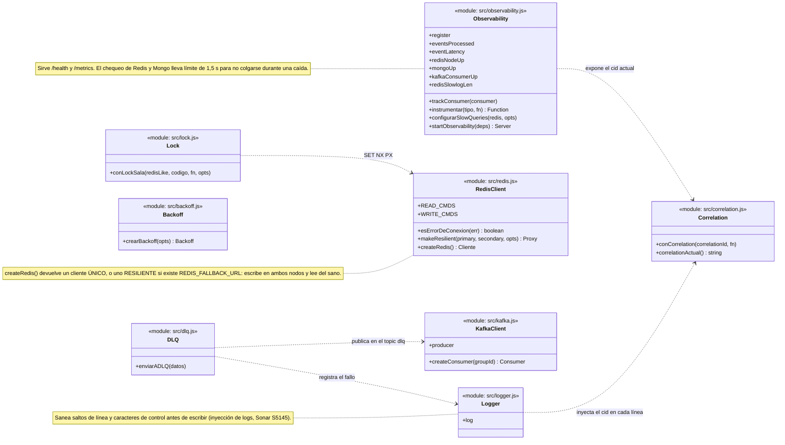

| Módulo | auth | gateway | room | game | timer | chat | voice | bot | observ. |
|---|:-:|:-:|:-:|:-:|:-:|:-:|:-:|:-:|:-:|
| `correlation.js` | | | ✅ | ✅ | ✅ | ✅ | ✅ | ✅ | ✅ |
| `logger.js` | ✅ | ✅ | ✅ | ✅ | ✅ | ✅ | ✅ | ✅ | ✅ |
| `redis.js` | ✅ | ✅ | ✅ | ✅ | ✅ | ✅ | ✅ | | ✅ |
| `kafka.js` | | ✅ | ✅ | ✅ | ✅ | ✅ | ✅ | ✅ | ✅ |
| `dlq.js` | | | ✅ | ✅ | | ✅ | ✅ | | |
| `lock.js` | | ✅ | ✅ | ✅ | | | | | |
| `backoff.js` | | ✅ | | ✅ | | | | | |
| `observability.js` | | | ✅ | ✅ | ✅ | ✅ | ✅ | ✅ | ✅ |

> `auth` y `gateway` no usan `observability.js`: exponen `/metrics` con Express a través de
> su propio `metrics.js` + `httpMetricsMiddleware.js`.

---

## 1. auth

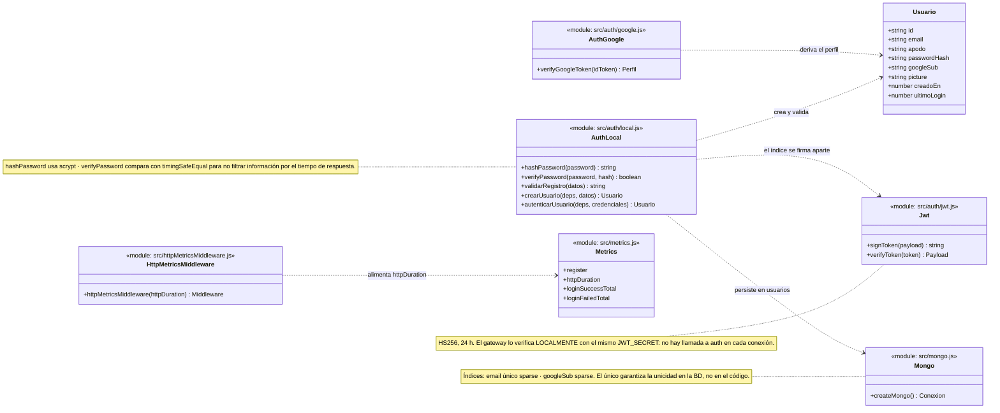

---

## 2. gateway

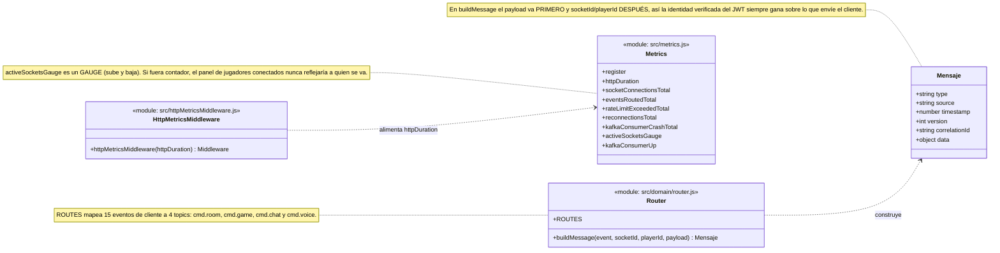

---

## 3. room

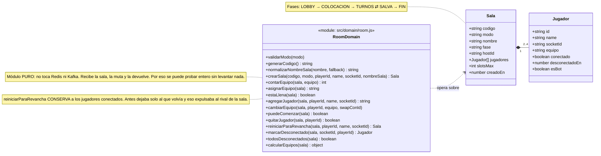

---

## 4. game

El repositorio más grande: **8 módulos de dominio** (reglas puras) y **9 handlers**
(orquestación con Redis y Kafka). La separación es deliberada: las reglas se prueban sin
infraestructura.

### 4.1 Dominio (reglas puras)

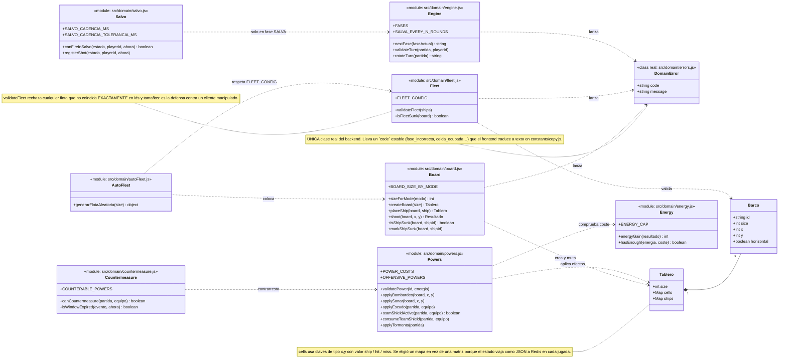

### 4.2 Handlers (orquestación)

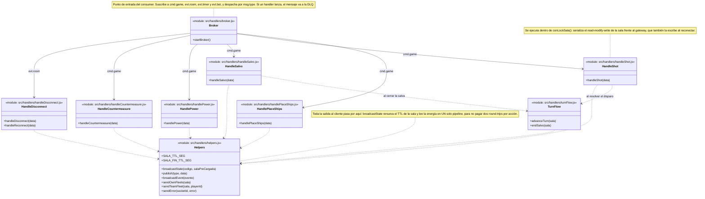

---

## 5. timer

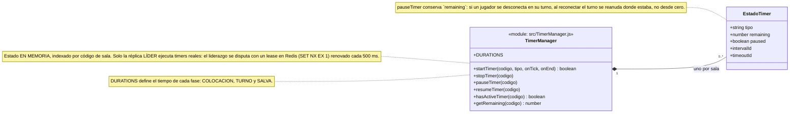

---

## 6. chat

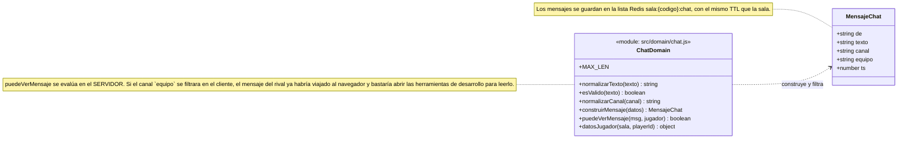

---

## 7. voice-channel

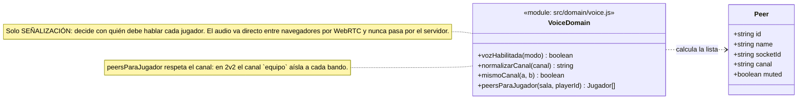

---

## 8. bot

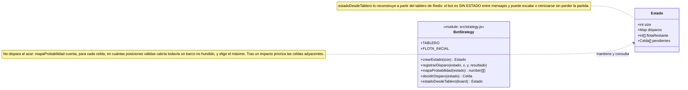

---

## 9. observability

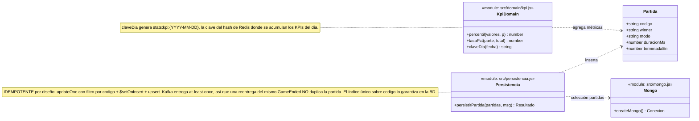

---

## Cobertura de la auditoría

Todos los módulos con lógica propia de cada repositorio están representados. Lo que **no**
aparece, y por qué:

| Excluido | Motivo |
|---|---|
| `index.js` (los 9) | Arranque y cableado: conecta Redis/Kafka, suscribe topics y registra handlers. No tiene modelo que dibujar. |
| `tracing.js` (los 9) | Bootstrap opt-in de OpenTelemetry. Sin `OTEL_EXPORTER_OTLP_ENDPOINT` no ejecuta nada. |

La correspondencia entre estos diagramas y el código se comprueba de forma automática:

```powershell
node tools/verificar-diagrama-clases.mjs
```

El script contrasta cada operación citada contra los `export` reales del módulo indicado y
falla si alguno no existe — así el diagrama no se desincroniza en silencio cuando se
renombra una función.
