# Diagramas de secuencia — una por interacción

Complemento de [`DIAGRAMAS.md`](DIAGRAMAS.md), que contiene el diagrama de secuencia
principal (el disparo). Aquí está **cada interacción del jugador por separado**, derivada del
código real: nombres de eventos, topics, puertos y claves de Redis tal como están hoy.

| # | Interacción | Servicios que intervienen |
|---|---|---|
| 1 | [Inicio de sesión](#1-inicio-de-sesión) | frontend · auth · Google · Mongo |
| 2 | [Crear sala](#2-crear-sala) | gateway · room |
| 3 | [Unirse a una sala](#3-unirse-a-una-sala) | gateway · room · chat · voice-channel |
| 4 | [Colocar los barcos](#4-colocar-los-barcos) | gateway · game · timer |
| 5 | [Disparar](#5-disparar) | gateway · game · timer · observability |
| 6 | [Usar un poder](#6-usar-un-poder) | gateway · game |
| 7 | [Escribir en el chat](#7-escribir-en-el-chat) | gateway · chat |
| 8 | [Entrar al chat de voz](#8-entrar-al-chat-de-voz) | gateway · voice-channel (WebRTC P2P) |
| 9 | [Fin de partida y revancha](#9-fin-de-partida-y-revancha) | game · room |
| 10 | [Cerrar sesión](#10-cerrar-sesión) | frontend · gateway |
| 11 | [Cómo se observa una jugada](#11-cómo-se-observa-una-jugada-métricas-logs-y-alertas) | Prometheus · promtail · Loki · Alertmanager · Grafana |

**Convención común a todas:** el gateway publica en `cmd.*` con `key = código de sala`
(garantiza orden por partición) y un `correlationId` que acompaña al evento por todos los
servicios. La respuesta al cliente vuelve por `gw.broadcast`, que las **3 réplicas** consumen
en fan-out.

---

## 1. Inicio de sesión

Dos caminos: cuenta local (email + contraseña) o Google. Ambos acaban en el **mismo JWT
propio** (HS256, 24 h) que el gateway verifica en el handshake del socket.

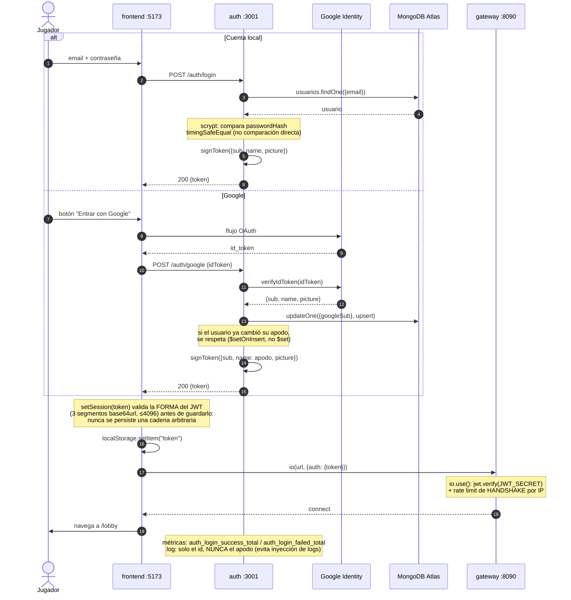

**Detalle a defender:** `auth` registra únicamente el `id` en los logs, nunca el apodo. El
apodo lo escribe el usuario y no debe llegar crudo al log (hallazgo Sonar `S5145`).

---

## 2. Crear sala

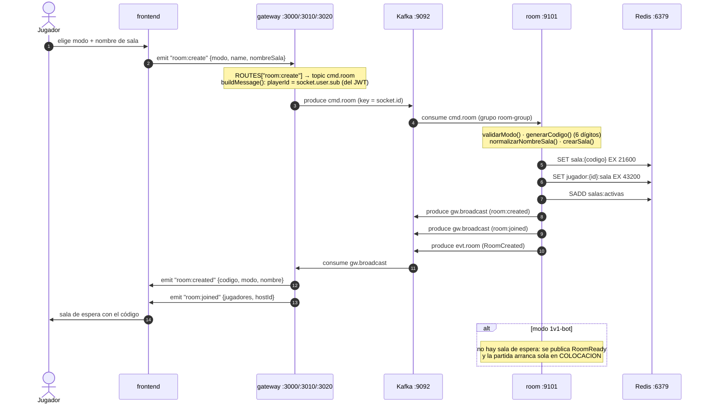

---

## 3. Unirse a una sala

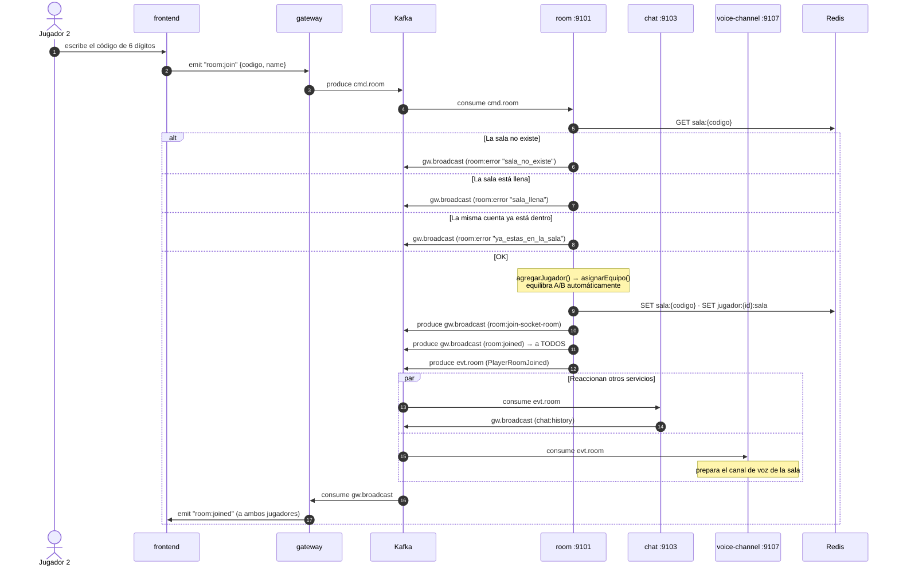

---

## 4. Colocar los barcos

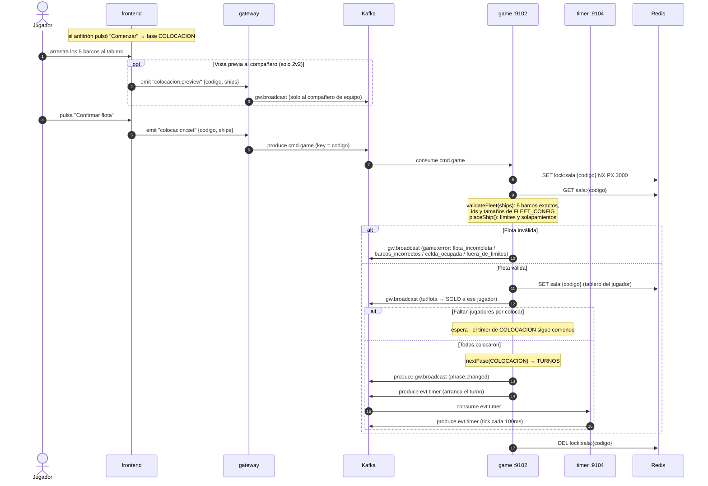

**Nota sobre el bot:** en `1v1-bot`, `game` llama a `generarFlotaAleatoria()`
(`domain/autoFleet.js`), que coloca los 5 barcos sin solapes con hasta 300 intentos por barco.

---

## 5. Disparar

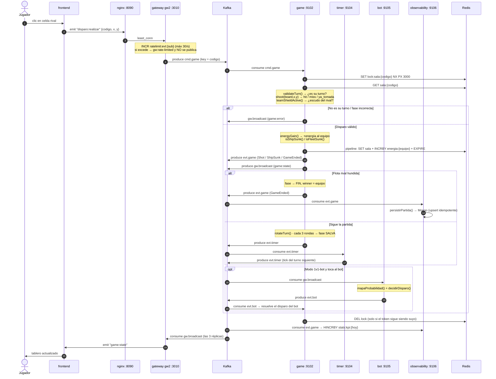

---

## 6. Usar un poder

Cuatro poderes con coste en energía: **bombardeo** (2E), **sonar** (2E), **escudo** (1E) y
**tormenta** (3E, una sola vez por partida).

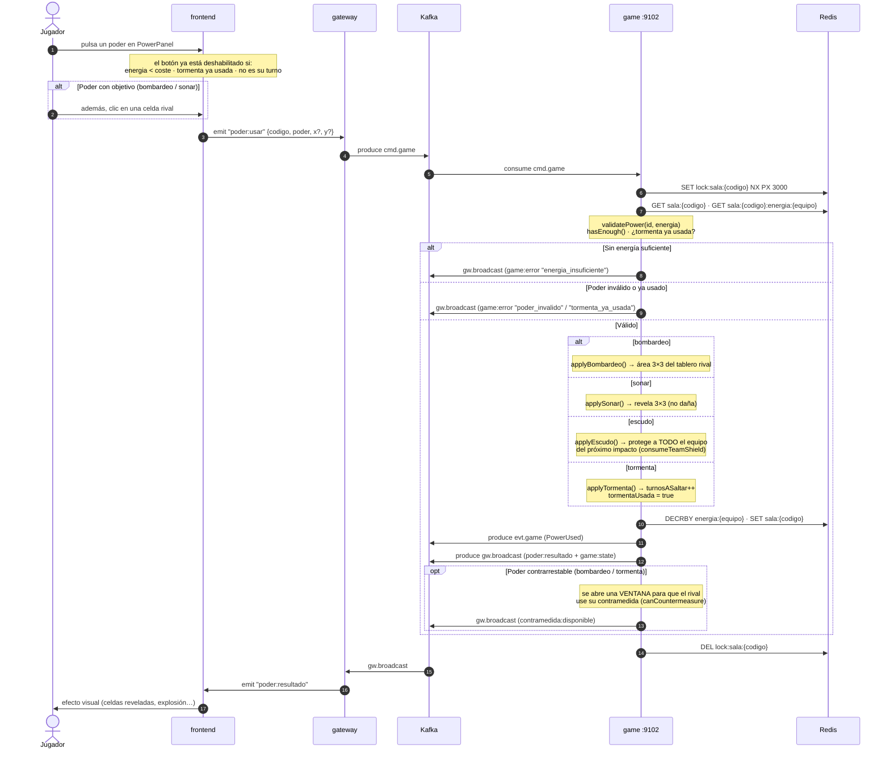

---

## 7. Escribir en el chat

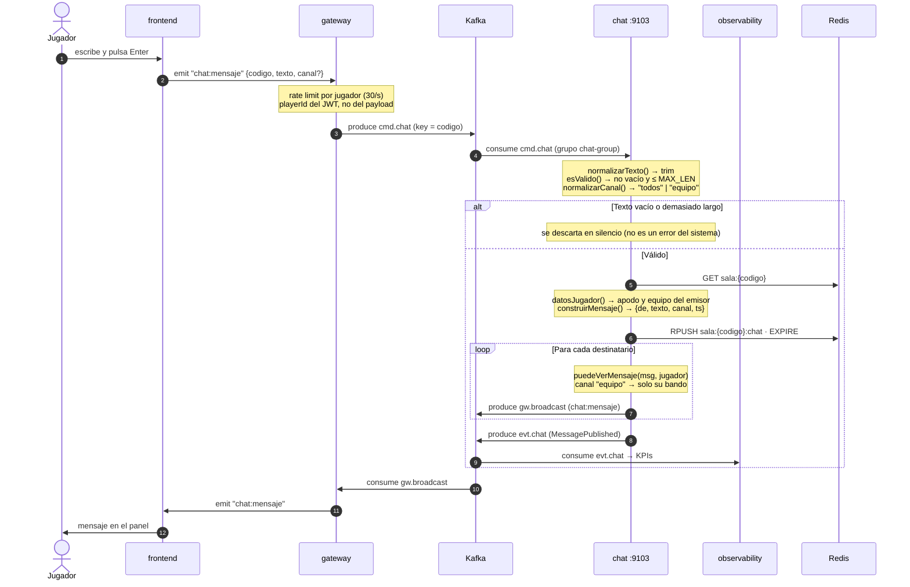

**Detalle:** el canal `equipo` se filtra **en el servidor**, no en el cliente. Si se filtrara
en el frontend, el mensaje del rival ya habría viajado al navegador y bastaría abrir las
herramientas de desarrollo para leerlo.

---

## 8. Entrar al chat de voz

La señalización va por el servidor; **el audio va directo entre navegadores** (WebRTC P2P),
sin pasar por la infraestructura.

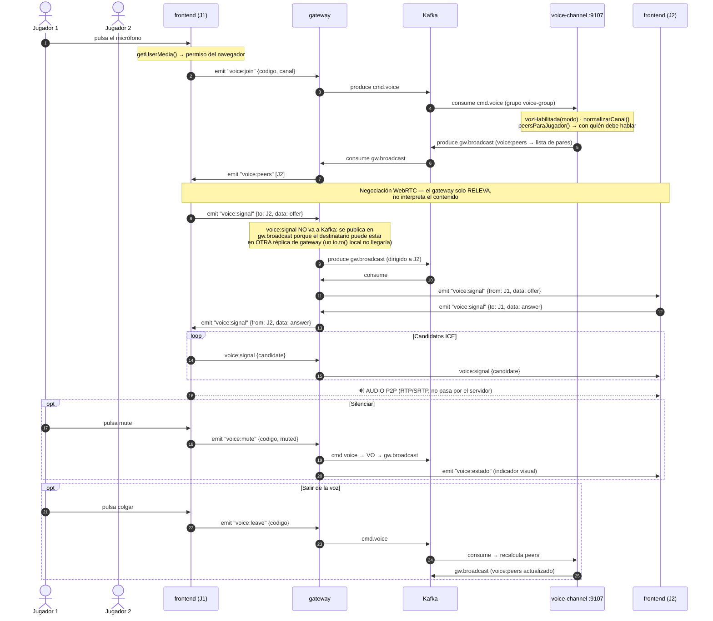

---

## 9. Fin de partida y revancha

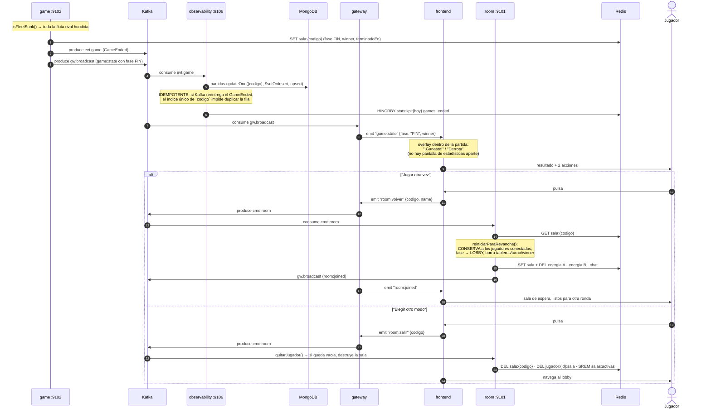

**El fallo que corrige esta versión:** antes, "volver a la sala" dejaba en la sala **solo al
que pulsaba**, y el rival quedaba fuera sin enterarse. Además había una pantalla de
estadísticas aparte que repetía quién había ganado; se eliminó porque el overlay ya lo dice.

---

## 10. Cerrar sesión

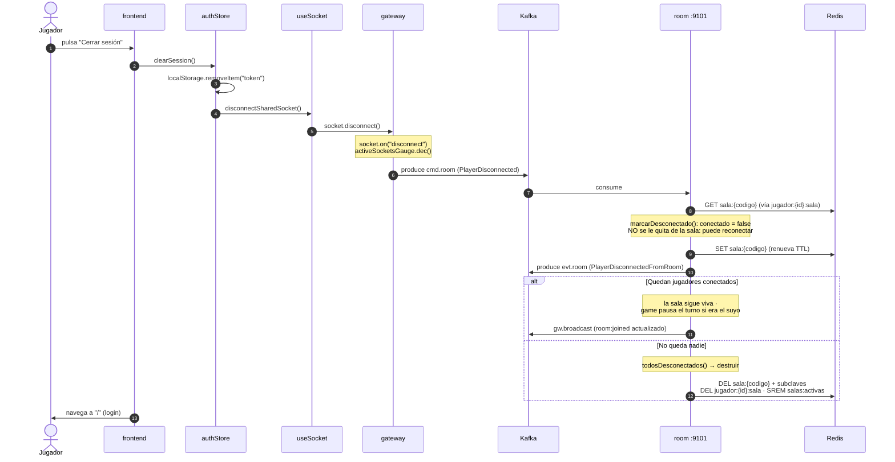

**Por qué la desconexión no expulsa:** el jugador se marca como `conectado: false` pero
permanece en la sala. Si vuelve antes de que expire el TTL, el gateway lo reconecta a su
partida (`jugador:{id}:sala` lo localiza en O(1)) y el turno se reanuda. Solo cuando **todos**
están desconectados se destruye la sala.

---

## 11. Cómo se observa una jugada (métricas, logs y alertas)

Las nueve interacciones anteriores describen el **camino del juego**. Este describe el
**camino de la observabilidad**, que corre en paralelo y no bloquea ninguna jugada: es lo que
hace que un incidente se vea en vez de adivinarse.

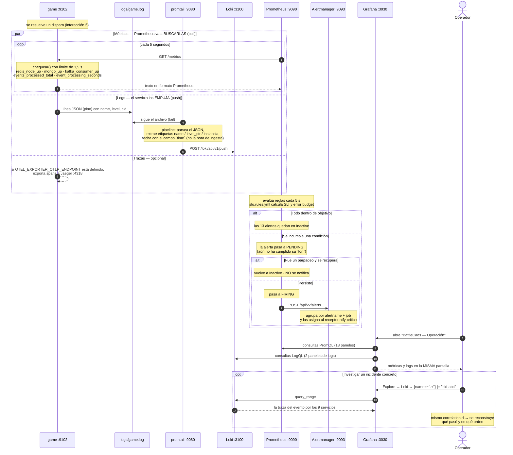

**Los dos modelos que conviven, y conviene saber distinguir:**

| | Métricas | Logs |
|---|---|---|
| Quién toma la iniciativa | **Prometheus va a buscarlas** (pull, cada 5 s) | **El servicio los emite** y promtail los recoge (push) |
| Qué responden | "cuánto y con qué latencia" | "qué pasó exactamente, y a quién" |
| Coste | bajo y constante | crece con el volumen |

**Por qué `/metrics` tiene límite de tiempo:** ese endpoint pinguea Redis y Mongo. Sin un
tope, con Redis caído se quedaba colgado y Prometheus daba el target por muerto — el panel se
quedaba en blanco justo durante la incidencia. Con el límite de 1,5 s siempre responde y
publica `redis_node_up 0`, que es la información que hacía falta.

---

## Cómo ver estos diagramas

- **En GitHub**: se renderizan solos al abrir este archivo.
- **En VS Code**: extensión *Markdown Preview Mermaid Support*.
- **Exportar a imagen**: pega el bloque en <https://mermaid.live>.
