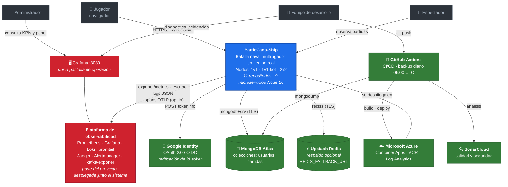
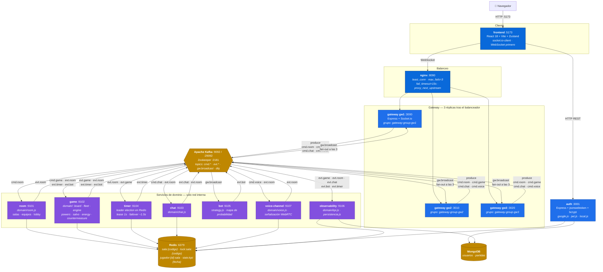
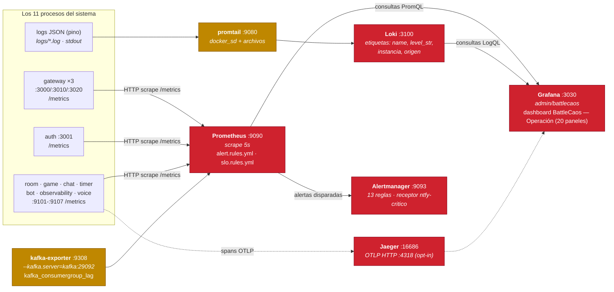
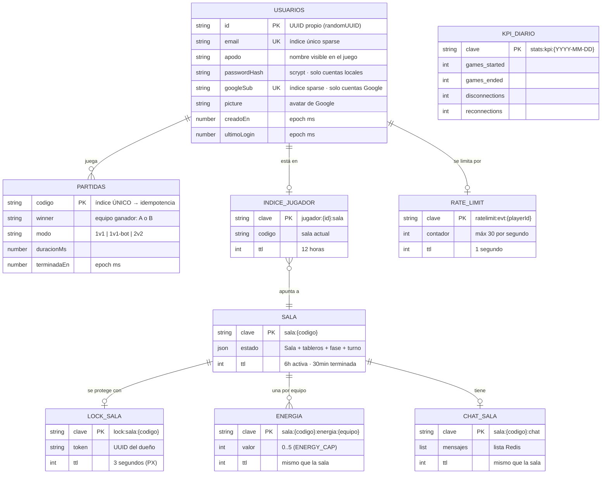
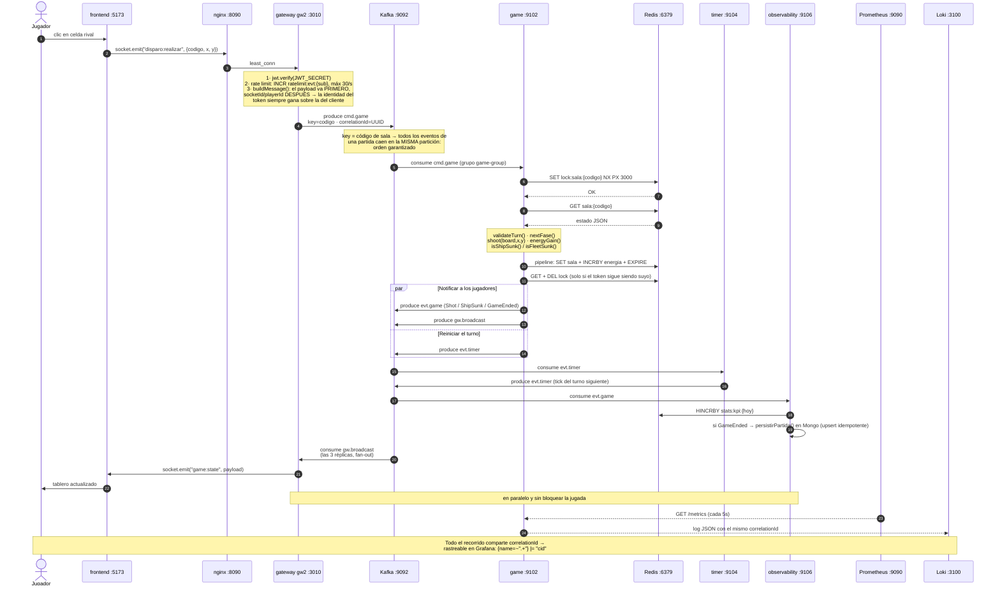

# Diagramas de arquitectura — BattleCaos-Ship

Los seis diagramas exigidos para la sustentación, en **Mermaid**. GitHub los renderiza al
abrir este archivo; no hace falta ninguna herramienta.

Están derivados del **código real**: los nombres de módulos y funciones, los topics, los
puertos y las imágenes de contenedor salen de los repositorios tal como están hoy, no de la
propuesta inicial.

| # | Diagrama | Responde a |
|---|---|---|
| 1 | [Contexto](#1-contexto) | ¿Quién usa el sistema y de qué depende? |
| 2 | [Componentes](#2-componentes) | ¿Qué hace cada servicio, en qué puerto, y cómo se comunican? |
| 3 | [Despliegue](#3-despliegue) | ¿Qué corre dónde, con qué imagen y en qué puerto? |
| 4 | [Clases](#4-clases-modelo-de-dominio) | ¿Cómo está modelado el dominio? |
| 5 | [Entidad-relación](#5-entidad-relación-persistencia) | ¿Qué se persiste y cómo se relaciona? |
| 6 | [Secuencia](#6-secuencia-un-disparo-de-punta-a-punta) | ¿Cómo fluye una jugada de punta a punta? |
| 6.1 | [Modo Salva](#61-caso-especial-el-modo-salva-fuego-libre-simultáneo) | ¿Cómo funciona el fuego libre simultáneo, la función más importante del juego? |

### ¿Dónde está la observabilidad?

Prometheus, Grafana, Loki, promtail, Jaeger, Alertmanager y kafka-exporter **son parte del
proyecto** y aparecen en los diagramas donde aportan información:

| Diagrama | ¿Aparecen? | Por qué |
|---|---|---|
| Contexto | ✅ Sí | Es una capacidad del sistema, y el operador entra por Grafana |
| Componentes | ✅ En su **propio sub-diagrama** | Meterlas en el principal lo volvía ilegible: son un plano transversal que observa a los 11 procesos, no un eslabón más de la cadena del juego |
| Despliegue | ✅ Sí, con imagen y puerto | Es donde se ve que corren en Docker aparte, y que en Azure el equivalente es Log Analytics |
| Clases · Entidad-relación | ❌ No | Son herramientas de terceros: no tienen clases de nuestro dominio ni entidades en nuestra base de datos |
| Secuencia | ✅ En el disparo y en el **nº 11** de [`DIAGRAMAS-SECUENCIA.md`](DIAGRAMAS-SECUENCIA.md) | Añadirlas a las 10 interacciones repetiría el mismo bucle de scrape en todas; se documenta una vez, completo |

### Tabla de puertos (referencia rápida)

| Componente | Puerto local | Puerto en contenedor | Protocolo |
|---|---|---|---|
| frontend (Vite dev) | 5173 | 80 (nginx, imagen de producción) | HTTP |
| **nginx balanceador** | 8090 | — | HTTP/WS |
| gateway `gw1` / `gw2` / `gw3` | 3000 / 3010 / 3020 | 3000 | HTTP + WebSocket |
| auth | 3001 | 3001 | HTTP |
| room · game · chat · timer | 9101 · 9102 · 9103 · 9104 | 9100 | HTTP (`/health`, `/metrics`) |
| bot · observability · voice-channel | 9105 · 9106 · 9107 | 9100 | HTTP (`/health`, `/metrics`) |
| Kafka | 9092 | 29092 (interno) | TCP |
| Zookeeper | 2181 | 2181 | TCP |
| Redis | 6379 | 6379 | TCP |
| **Prometheus** | 9090 | 9090 | HTTP |
| **Grafana** | 3030 | 3000 | HTTP |
| **Loki** | 3100 | 3100 | HTTP |
| promtail | 9080 | 9080 | HTTP |
| Alertmanager | 9093 | 9093 | HTTP |
| Jaeger (UI / OTLP) | 16686 / 4318 | 16686 / 4318 | HTTP |
| kafka-exporter | 9308 | 9308 | HTTP |
| Kafka UI | 8080 | 8080 | HTTP |

---

## 1. Contexto



**Lo que hay que decir:** el sistema es autónomo salvo por tres dependencias de datos.
Google solo **verifica** identidad —el JWT propio (HS256, 24 h) lo emite `auth`—, Mongo
guarda lo que debe sobrevivir a un reinicio, y Upstash es un respaldo **opcional** que solo
se activa si existe `REDIS_FALLBACK_URL`.

---

## 2. Componentes

Los 9 microservicios con su puerto, su módulo de dominio y los topics exactos que publican
y consumen. Se muestran las **3 réplicas de gateway**, cada una con su consumer group.



### Observabilidad (plano transversal)

Corre en paralelo al sistema: **no** participa en el juego, solo lo observa.



### Convención de topics

| Topic | Publica | Consume | Contenido |
|---|---|---|---|
| `cmd.room` | gateway | room | crear/unirse/equipo/comenzar/salir |
| `cmd.game` | gateway | game | disparo · salva · poder · colocación · contramedida |
| `cmd.chat` | gateway | chat | mensajes del jugador |
| `cmd.voice` | gateway | voice-channel | join/leave/mute |
| `evt.room` | room, chat, voice-channel, game | game, timer, chat, voice-channel, observability | sala creada, jugador unido/desconectado |
| `evt.game` | game | observability, gateway | disparo resuelto, barco hundido, fin de partida |
| `evt.timer` | timer, game | game, observability | ticks y expiraciones de fase |
| `evt.chat` | chat | observability | mensaje publicado |
| `evt.bot` | bot, game | game, observability | jugada del bot |
| `gw.broadcast` | todos los de dominio | **las 3 réplicas de gateway** | payload listo para emitir al socket |
| `dlq` | cualquiera | inspección manual | mensajes que fallaron, con error y contexto |

**El detalle clave:** cada réplica de gateway consume `gw.broadcast` en su **propio consumer
group** (`gateway-group-gw1/2/3`). Así las tres reciben *todos* los mensajes (fan-out) y cada
una los entrega a sus sockets locales. Si compartieran grupo, Kafka repartiría los mensajes
entre ellas y un jugador dejaría de recibir los suyos.

---

## 3. Despliegue

```mermaid
graph TB
    subgraph dev["💻 Entorno LOCAL (desarrollo y pruebas)"]
        subgraph procesos["Procesos Node en el host (levantar-todo.ps1)"]
            P1["gateway ×3 · auth<br/>room · game · chat · timer<br/>bot · observability · voice-channel"]
        end
        subgraph dockerloc["Docker Desktop"]
            D1["battlecaos-kafka :9092<br/>battlecaos-zookeeper :2181<br/>battlecaos-redis :6379"]
            D2["battlecaos-gateway-lb :8090<br/><i>nginx:1.27-alpine</i>"]
            subgraph obsloc["Stack de observabilidad (deploy/monitoring)"]
                PRO["<b>Prometheus</b> :9090<br/><i>prom/prometheus:v2.53.0</i><br/>scrape 5s · 13 reglas de alerta"]
                GRA["<b>Grafana</b> :3030<br/><i>grafana/grafana:11.1.0</i><br/>20 paneles · 2 datasources"]
                LOK["<b>Loki</b> :3100<br/><i>grafana/loki:3.0.0</i>"]
                PTL["<b>promtail</b> :9080<br/><i>grafana/promtail:3.0.0</i><br/>docker_sd + logs/*.log"]
                JAE["<b>Jaeger</b> :16686 · OTLP :4318<br/><i>jaegertracing/all-in-one:1.58</i>"]
                ALM["<b>Alertmanager</b> :9093<br/><i>prom/alertmanager:v0.27.0</i>"]
                KEX["<b>kafka-exporter</b> :9308<br/><i>danielqsj/kafka-exporter:v1.7.0</i>"]
            end
        end
        V["vite dev :5173"]
    end

    subgraph azure["☁️ AZURE — grupo de recursos battlecaosdev-rg"]
        ACR["<b>Azure Container Registry</b><br/>battlecaosdev · SKU Basic<br/><i>admin_enabled · 12 imágenes</i>"]

        subgraph cae["Container Apps Environment — battlecaosdev-env"]
            subgraph ext["Ingress EXTERNO (HTTPS público)"]
                CF["battlecaosdev-frontend<br/><i>nginx :80</i>"]
                CG["battlecaosdev-gateway<br/><i>:3000 · WebSocket</i>"]
                CA["battlecaosdev-auth<br/><i>:3001</i>"]
            end
            subgraph int["Ingress INTERNO (solo dentro del Environment)"]
                CR["room :9100"]
                CGA["game :9100"]
                CT["timer :9100"]
                CC["chat :9100"]
                CB["bot :9100"]
                CV["voice-channel :9100"]
                CO["observability :9100"]
                CK["kafka :29092 (TCP)"]
                CRD["redis :6379 (TCP)"]
            end
        end

        LAW[("<b>Log Analytics Workspace</b><br/>battlecaosdev-logs<br/><i>PerGB2018 · 30 días</i><br/>ContainerAppConsoleLogs_CL")]
    end

    subgraph fuera["🌐 Fuera de Azure"]
        AT[("MongoDB Atlas")]
        GO["Google Identity"]
        GHA["GitHub Actions<br/><i>OIDC federado, sin secretos de larga vida</i>"]
        TF[("Estado de Terraform<br/>battlecaos-tfstate-rg<br/><i>backend azurerm</i>")]
    end

    V --> D2 --> P1
    P1 <--> D1

    P1 -.->|"scrape /metrics cada 5s"| PRO
    P1 -.->|"logs JSON en logs/*.log"| PTL
    P1 -.->|"spans OTLP (opt-in)"| JAE
    D1 -.-> KEX
    KEX -.-> PRO
    PTL --> LOK
    PRO -->|"alertas"| ALM
    PRO --> GRA
    LOK --> GRA
    JAE -.-> GRA

    ACR -.->|"docker pull"| cae
    CG <-->|"TCP interno"| CK
    CK <--> CR & CGA & CT & CC & CB & CV & CO
    CR & CGA & CT & CC & CV --> CRD
    CA --> AT
    CO --> AT
    CA --> GO
    cae -.->|"stdout"| LAW

    GHA -->|"build & push"| ACR
    GHA -->|"az containerapp update"| cae
    GHA -->|"mongodump diario"| AT
    GHA -->|"terraform apply"| TF

    classDef pub fill:#1f6feb,stroke:#0d419d,color:#fff
    classDef priv fill:#8250df,stroke:#5a32a3,color:#fff
    classDef infra fill:#bf8700,stroke:#7d4e00,color:#fff
    classDef obs fill:#cf222e,stroke:#82071e,color:#fff
    class CF,CG,CA pub
    class CR,CGA,CT,CC,CB,CV,CO,CK,CRD priv
    class ACR,AT,GO,GHA,TF infra
    class PRO,GRA,LOK,PTL,JAE,ALM,KEX,LAW obs
```



**La decisión de seguridad que hay que defender:** solo `frontend`, `gateway` y `auth` tienen
ingress externo. Los 7 servicios de dominio, Kafka y Redis son **inalcanzables desde
Internet**. Es lo que sostiene la aceptación del hallazgo `S6382` en SonarCloud.

**Diferencia local vs desplegado que conviene señalar:** el stack de observabilidad
(Prometheus, Grafana, Loki, Jaeger, Alertmanager) corre **solo en local**. En Azure los logs
van a Log Analytics y se consultan con KQL; las métricas se exponen en `/metrics` pero
todavía nadie las recolecta.

---

## 4. Clases (modelo de dominio)

**Un solo diagrama con todo el dominio del sistema**, agrupado por contexto. Los nombres,
atributos y operaciones son **exactamente** los del código.

### Cómo leerlo

El backend es JavaScript con módulos ES: las **entidades** son objetos que viajan como JSON
(a Redis o por Kafka) y las **reglas** son funciones exportadas agrupadas por archivo. En el
diagrama se distinguen así:

| Estereotipo | Significado | Ejemplo |
|---|---|---|
| *(sin estereotipo)* | **Entidad**: solo atributos. Es estado que se serializa. | `Sala`, `Tablero` |
| `<<reglas>>` | **Módulo de reglas puras**: solo operaciones, sin estado propio ni acceso a infraestructura. | `ReglasFlota` |
| `<<error>>` | La única `class` real del backend. | `DomainError` |

El diagrama está partido en **cinco capas** (`namespace` de Mermaid): Identidad, Sala,
Partida, Comunicación e Histórico. Cada caja dibuja su título arriba y encierra solo las
clases de esa capa — con eso alcanza para saber a qué capa pertenece cualquier clase, sin
necesidad de leer relaciones. Las flechas *entre* cajas son las dependencias reales entre
capas; las flechas *dentro* de una caja son dependencias internas de esa capa.

```mermaid
classDiagram
    direction TB

    namespace Identidad {
        class Usuario {
            +string id
            +string email
            +string apodo
            +string passwordHash
            +string googleSub
            +string picture
            +number creadoEn
            +number ultimoLogin
        }
        class ReglasCuenta {
            <<reglas>>
            +validarRegistro(datos) string
            +hashPassword(password) string
            +verifyPassword(password, hash) boolean
            +crearUsuario(deps, datos) Usuario
            +autenticarUsuario(deps, credenciales) Usuario
        }
        class ReglasToken {
            <<reglas>>
            +signToken(payload) string
            +verifyToken(token) Payload
            +verifyGoogleToken(idToken) Perfil
        }
    }

    namespace Sala {
        class Sala {
            +string codigo
            +string modo
            +string nombre
            +string fase
            +string hostId
            +Jugador[] jugadores
            +int slotsMax
            +number creadoEn
        }
        class Jugador {
            +string id
            +string name
            +string socketId
            +string equipo
            +boolean conectado
            +number desconectadoEn
            +boolean esBot
        }
        class ReglasSala {
            <<reglas>>
            +validarModo(modo) void
            +generarCodigo() string
            +normalizarNombreSala(nombre, fallback) string
            +crearSala(codigo, modo, playerId, name, socketId, nombreSala) Sala
            +agregarJugador(sala, playerId, name, socketId) string
            +quitarJugador(sala, playerId) boolean
            +cambiarEquipo(sala, playerId, equipo, swapConId) void
            +asignarEquipo(sala) string
            +contarEquipo(sala, equipo) int
            +calcularEquipos(sala) object
            +estaLlena(sala) boolean
            +puedeComenzar(sala) boolean
            +marcarDesconectado(sala, socketId, playerId) Jugador
            +todosDesconectados(sala) boolean
            +reiniciarParaRevancha(sala, playerId, name, socketId) Sala
        }
    }

    namespace Partida {
        class EstadoPartida {
            +string fase
            +Turno turno
            +Map~string,Tablero~ tableros
            +string[] colocados
            +Map~string,int~ energia
            +Map~string,boolean~ escudos
            +boolean tormentaUsada
            +int turnosASaltar
            +Salva salvoActual
            +string winner
            +number terminadoEn
        }
        class Turno {
            +string jugadorActual
            +string rotacionId
            +int numeroTurno
            +boolean pausado
        }
        class Salva {
            +Map~string,number~ ultimoDisparo
        }
        class Tablero {
            +int size
            +Map~string,string~ cells
            +Map~string,Celda[]~ ships
        }
        class Barco {
            +string id
            +int size
            +int x
            +int y
            +boolean horizontal
        }
        class ReglasTablero {
            <<reglas>>
            +BOARD_SIZE_BY_MODE
            +sizeForMode(modo) int
            +createBoard(size) Tablero
            +placeShip(board, ship) Tablero
            +shoot(board, x, y) Resultado
            +isShipSunk(board, shipId) boolean
            +markShipSunk(board, shipId) void
        }
        class ReglasFlota {
            <<reglas>>
            +FLEET_CONFIG
            +validateFleet(ships) void
            +isFleetSunk(board) boolean
            +generarFlotaAleatoria(size) object
        }
        class MotorFases {
            <<reglas>>
            +FASES
            +SALVA_EVERY_N_ROUNDS
            +nextFase(faseActual) string
            +validateTurn(partida, playerId) void
            +rotateTurn(partida) Resultado
        }
        class ReglasEnergia {
            <<reglas>>
            +ENERGY_CAP
            +energyGain(hit, hundido) int
            +hasEnough(energia, coste) boolean
        }
        class ReglasPoderes {
            <<reglas>>
            +POWER_COSTS
            +OFFENSIVE_POWERS
            +validatePower(sala, playerId, powerType, energia) void
            +applyBombardeo(board, x, y) Resultado
            +applySonar(board, x, y) Resultado
            +applyEscudo(partida, equipo) Resultado
            +teamShieldActive(partida, equipo) boolean
            +consumeTeamShield(partida, equipo) void
            +applyTormenta(partida, playerId) Resultado
        }
        class ReglasSalva {
            <<reglas>>
            +SALVO_CADENCIA_MS
            +SALVO_CADENCIA_TOLERANCIA_MS
            +canFireInSalvo(estado, playerId, ahora) boolean
            +registerShot(estado, playerId, ahora) void
        }
        class ReglasContramedida {
            <<reglas>>
            +COUNTERABLE_POWERS
            +canCountermeasure(partida, equipo) boolean
            +isWindowExpired(evento, ahora) boolean
        }
        class DomainError {
            <<error>>
            +string code
            +string message
            +string name
        }
    }

    namespace Comunicacion {
        class MensajeChat {
            +string de
            +string texto
            +string canal
            +string equipo
            +number ts
        }
        class ReglasChat {
            <<reglas>>
            +MAX_LEN
            +normalizarTexto(texto) string
            +esValido(texto) boolean
            +normalizarCanal(canal) string
            +construirMensaje(datos) MensajeChat
            +puedeVerMensaje(msg, jugador) boolean
            +datosJugador(sala, playerId) object
        }
        class ReglasVoz {
            <<reglas>>
            +vozHabilitada(modo) boolean
            +normalizarCanal(canal) string
            +mismoCanal(a, b) boolean
            +peersParaJugador(sala, playerId) Jugador[]
        }
    }

    namespace Historico {
        class PartidaTerminada {
            +string codigo
            +string winner
            +string modo
            +number duracionMs
            +number terminadaEn
        }
        class ReglasKpi {
            <<reglas>>
            +percentil(valores, p) number
            +tasaPct(parte, total) number
            +claveDia(fecha) string
        }
        class EstrategiaBot {
            <<reglas>>
            +TABLERO
            +FLOTA_INICIAL
            +crearEstado(size) Estado
            +registrarDisparo(estado, x, y, resultado) void
            +mapaProbabilidad(estado) number[][]
            +decidirDisparo(estado) Celda
            +estadoDesdeTablero(board) Estado
        }
    }

    Sala "1" *-- "2..4" Jugador : contiene
    Sala "1" o-- "0..1" EstadoPartida : al comenzar
    EstadoPartida "1" *-- "1" Turno : turno actual
    EstadoPartida "1" o-- "0..1" Salva : solo en fase SALVA
    EstadoPartida "1" *-- "1..2" Tablero : uno por equipo
    Tablero "1" *-- "5..10" Barco : flota del equipo
    Jugador "1" ..> "0..*" MensajeChat : escribe
    Sala "1" ..> "0..1" PartidaTerminada : al terminar

    ReglasCuenta ..> Usuario : crea y valida
    ReglasToken ..> Usuario : emite la sesión
    ReglasSala ..> Sala : ciclo de vida
    ReglasTablero ..> Tablero : crea y muta
    ReglasFlota ..> Barco : valida la flota
    MotorFases ..> EstadoPartida : transiciones y turnos
    ReglasPoderes ..> Tablero : aplica efectos
    ReglasSalva ..> Salva : controla la cadencia
    ReglasContramedida ..> EstadoPartida : ventana de respuesta
    ReglasChat ..> MensajeChat : construye y filtra
    ReglasVoz ..> Jugador : calcula los pares de voz
    EstrategiaBot ..> Tablero : decide el disparo
    ReglasKpi ..> PartidaTerminada : agrega


    ReglasFlota ..> ReglasTablero : coloca con placeShip
    ReglasPoderes ..> ReglasEnergia : consulta el coste
    ReglasPoderes ..> ReglasTablero : dispara en área
    ReglasSalva ..> MotorFases : solo en fase SALVA
    ReglasContramedida ..> ReglasPoderes : contrarresta
    ReglasTablero ..> DomainError : lanza
    ReglasFlota ..> DomainError : lanza
    MotorFases ..> DomainError : lanza
    ReglasPoderes ..> DomainError : lanza
```

### Qué explica cada capa (namespace)

El diagrama ya deja cada clase dentro del bloque `namespace` de su capa — la caja con
título agrupa visualmente todo lo que pertenece a ese contexto. Lo que antes iban como
notas sueltas dentro del diagrama, ahora es esta tabla, capa por capa:

| Capa (`namespace`) | Clase | Qué hay que saber |
|---|---|---|
| **Identidad** | `Usuario` | Entidad persistida en Mongo; `passwordHash` solo existe en cuentas locales, `googleSub` solo en cuentas Google. |
| **Sala** | `Sala` | Máquina de fases: `LOBBY → COLOCACION → TURNOS ⇄ SALVA → FIN`. Cada N rondas se entra en SALVA (disparo simultáneo) y se vuelve a TURNOS. |
| **Partida** | `DomainError` | Única `class` real del backend. Lleva un `code` estable (`fase_incorrecta`, `celda_ocupada`, `energia_insuficiente`...) que el frontend traduce a texto legible en `constants/copy.js`. |
| **Partida** | `Tablero` | `cells` usa claves tipo `x,y` con valor `ship`/`hit`/`miss`. Es un mapa (no una matriz) porque el estado viaja como JSON a Redis en cada jugada. En 2v2 el tablero es **compartido por equipo** y los ids de barco se prefijan con el jugador. |
| **Partida** | `ReglasFlota` | `FLEET_CONFIG`: portaaviones(5), acorazado(4), crucero(3), submarino(3), destructor(2). `validateFleet` rechaza cualquier flota que no coincida exactamente en ids y tamaños — es la defensa contra un cliente manipulado. |
| **Histórico** | `EstrategiaBot` | No dispara al azar: `mapaProbabilidad` cuenta en cuántas posiciones válidas cabría aún un barco no hundido y elige el máximo. Tras un impacto, prioriza las celdas adyacentes. |

### Por qué el dominio está separado de la infraestructura

Ninguna de las clases de arriba toca Redis, Kafka ni HTTP. Reciben datos, aplican una regla
y devuelven el resultado (o lanzan `DomainError`). Esa frontera es deliberada y tiene una
consecuencia medible: **todo este diagrama se prueba sin levantar un solo contenedor**.

Quien lee de Redis, publica en Kafka y responde al cliente es la capa de *handlers*, que no
aparece aquí porque no es dominio.

### Correspondencia contexto ↔ microservicio

| Contexto del diagrama | Microservicio | Archivos |
|---|---|---|
| **Identidad** | `auth` | `auth/local.js` · `auth/jwt.js` · `auth/google.js` |
| **Sala** | `room` | `domain/room.js` |
| **Partida** | `game` | `domain/`: `board` · `fleet` · `autoFleet` · `engine` · `energy` · `powers` · `salvo` · `countermeasure` · `errors` |
| **Comunicación** | `chat` · `voice-channel` | `domain/chat.js` · `domain/voice.js` |
| **Histórico** | `observability` · `bot` | `domain/kpi.js` · `strategy.js` |

> El `gateway` no aparece: su único módulo de dominio (`router.js`) es una tabla de
> enrutado, no un modelo. El `timer` tampoco: su lógica es temporal (`TimerManager`), no de
> dominio. Ambos están en [`DIAGRAMAS-CLASES.md`](DIAGRAMAS-CLASES.md), junto al detalle
> por repositorio y la infraestructura común.

---

## 5. Entidad-relación (persistencia)



| Almacén | Entidades | Por qué ahí |
|---|---|---|
| **MongoDB Atlas** (durable) | `usuarios`, `partidas` | Debe sobrevivir a reinicios. Respaldo diario con 30 días de retención. |
| **Redis** (efímero, todo con TTL) | sala, energía, chat, índices, locks, KPIs, rate limit | Se lee y escribe en cada jugada: necesita latencia de milisegundos. |

**Tres decisiones que hay que saber explicar:**

- **`partidas.codigo` es índice único** y se escribe con `updateOne + $setOnInsert + upsert`.
  Kafka entrega *at-least-once*: si reentrega el mismo `GameEnded`, la partida **no se
  duplica**. La idempotencia la garantiza la base de datos, no la confianza en el broker.
- **`INDICE_JUGADOR` es un índice inverso.** Sin él, reencontrar la sala de un jugador al
  reconectar exigiría `KEYS sala:*` — O(N) y **bloqueante para todo Redis**. Con el índice es O(1).
- **TTL deslizante.** Cada cambio de estado renueva el TTL; una sala abandonada deja de
  refrescarse y expira sola. Sin esto se acumularían salas zombi hasta agotar la memoria.

---

## 6. Secuencia: un disparo de punta a punta



### Lo que sostiene la corrección de este flujo

| Mecanismo | Dónde vive | Problema que resuelve |
|---|---|---|
| **Key = código de sala** | `gateway/src/index.js` | Kafka ordena *por partición*: con esta key, dos disparos de la misma partida nunca se procesan al revés. |
| **Lock distribuido** `SET NX PX 3000` | `game/src/lock.js` | El particionado ordena dentro de `game`, pero no impide que el **gateway** escriba la misma sala durante una reconexión. |
| **Liberación con token** | `lock.js` | Solo borra el lock si sigue siendo suyo: si el TTL expiró y otro lo tomó, no se lo quita. |
| **`playerId` del JWT** | `domain/router.js` | El payload del cliente no puede sobrescribir la identidad verificada. |
| **Rate limit por jugador** | `gateway/src/index.js` | 30 eventos/s por `sub` (no por IP): varios jugadores tras el mismo NAT no se estorban. |
| **DLQ** | `src/dlq.js` | Un handler que revienta manda el mensaje a `dlq` con su error, en vez de perderlo. |
| **correlationId** | `src/correlation.js` (AsyncLocalStorage) | Un identificador recorre los 9 servicios y sobrevive a los `await`. |

---

### 6.1 Caso especial: el modo Salva (fuego libre simultáneo)

La mecánica más importante del juego: cada **3 rondas** (`SALVA_EVERY_N_ROUNDS × nº
jugadores` — 6 turnos en 1v1, 12 en 2v2), `rotateTurn()` abre una ventana de **8 segundos**
en la que **cualquier jugador de cualquier equipo dispara sin esperar turno**. Ahí dejan de
alcanzar los mecanismos de la sección anterior (pensados para un disparo a la vez) y entran
tres más: la **cola del cliente**, el **lock por celda** y **dos caminos redundantes** para
cerrar la ventana.

```mermaid
sequenceDiagram
    autonumber
    actor A as Ana (equipo A)
    actor B as Beto (equipo A · compañero)
    actor C as Carla (equipo B · rival)
    participant FE as frontend (cola de salva)
    participant GW as gateway
    participant K as Kafka
    participant GA as game :9102
    participant TI as timer :9104 (líder)
    participant R as Redis

    Note over GA: rotateTurn() calcula numeroTurno % umbralSalva === 0<br/>(SALVA_EVERY_N_ROUNDS=3 × nº jugadores → 6 turnos en 1v1, 12 en 2v2)
    GA->>R: SET sala:{codigo} (fase=SALVA · salvoActual={ultimoDisparo:{}})
    GA->>GA: setTimeout local de 8s (turnFlow.js) — arranca YA, primer camino
    GA->>K: produce evt.game (PhaseChanged TURNOS→SALVA)
    GA->>K: produce gw.broadcast (game:state)

    K->>TI: consume evt.game (solo el LÍDER actúa;<br/>lease SET NX EX 1, renovado cada 500ms)
    Note over TI: startTimer(codigo,'SALVA', DURATIONS.SALVA=8000ms)<br/>segundo camino, independiente del setTimeout de game

    K->>GW: consume gw.broadcast (fan-out a las 3 réplicas)
    GW->>FE: emit "game:state" {fase:"SALVA"}
    FE->>A: SalvoBanner — fuego libre
    FE->>B: SalvoBanner
    FE->>C: SalvoBanner

    Note over A,C: a partir de aquí CUALQUIER jugador de CUALQUIER equipo dispara<br/>sin esperar turno — la mecánica no existe en fase TURNOS

    par Ana y Beto (mismo equipo) apuntan a la MISMA celda del rival
        A->>FE: clic (x,y)
        FE->>GW: emit "salva:disparo" {x,y}
        GW->>K: produce cmd.game (key=codigo)
    and
        B->>FE: clic (x,y) — mismo instante
        FE->>GW: emit "salva:disparo" {x,y}
        GW->>K: produce cmd.game (key=codigo)
    end

    K->>GA: consume cmd.game (disparo de Ana)
    GA->>R: SET lock:sala:{codigo} NX PX 3000 (serializa el read-modify-write del blob)
    Note over GA: canFireInSalvo(Ana) → cadencia OK
    GA->>R: SET lock:sala:{codigo}:salva:x:y NX EX 10
    R-->>GA: OK — Ana llega primero
    GA->>R: shoot(board,x,y) → pipeline SET sala + INCRBY energia
    GA->>K: produce evt.game (ShotFired) + gw.broadcast (game:state)
    GA->>R: DEL lock:sala:{codigo}

    K->>GA: consume cmd.game (disparo de Beto, MISMA celda)
    GA->>R: SET lock:sala:{codigo}:salva:x:y NX EX 10
    R-->>GA: null — Ana ya la tomó
    GA->>K: gw.broadcast (game:error "celda_ya_tomada" {x,y})
    K->>GW: consume gw.broadcast
    GW->>FE: emit "game:error"
    FE->>B: toast "Un compañero ya tomó esa celda."

    par Carla dispara AL MISMO TIEMPO al tablero de Ana/Beto (equipo A)
        C->>FE: clic en el tablero rival
        FE->>GW: emit "salva:disparo"
        GW->>K: produce cmd.game
        K->>GA: consume → mismo flujo, sin choque (otra celda, otro tablero)
        GA->>K: gw.broadcast (game:state)
    end

    opt Ana dispara de nuevo antes de 130ms (180ms de cadencia − 50ms de tolerancia)
        A->>FE: clic rápido extra
        FE->>GW: emit "salva:disparo" (encolado, se drena cada 40ms)
        GW->>K: produce cmd.game
        K->>GA: consume
        Note over GA: canFireInSalvo() → false, cadencia no cumplida
        GA->>K: gw.broadcast (game:error "cadencia_no_cumplida" {x,y})
        K->>GW: consume gw.broadcast
        GW->>FE: emit "game:error"
        Note over FE: NO se descarta: vuelve a la cola (salvoQueue)<br/>y el intervalo de drenado lo reintenta — ningún clic se pierde
    end

    opt Un impacto hunde la ÚLTIMA nave rival
        Note over GA: isFleetSunk(board) → true, incluso a mitad de la ventana
        GA->>R: SET sala:{codigo} (fase=FIN · winner · salvoActual=null)
        GA->>K: produce evt.game (GameEnded) + gw.broadcast (game:state fase FIN)
        Note over GA: la salva termina AHORA — no espera los 8s
    end

    par Fin de la ventana — dos caminos, ambos llaman endSalvo()
        Note over GA: el setTimeout local cumple 8s → endSalvo(codigo) directo, sin Kafka
    and
        TI->>K: produce evt.timer (TimerEnd, tipo=SALVA)
        K->>GA: consume evt.timer
        GA->>GA: handleTimerEnd(SALVA) → endSalvo(codigo)
    end
    Note over GA: endSalvo() es IDEMPOTENTE: el camino que llega SEGUNDO<br/>ve sala.fase !== 'SALVA' y no hace nada

    GA->>R: SET sala:{codigo} (fase=TURNOS · turno.jugadorActual=jugadores[0] · numeroTurno+1)
    GA->>K: produce evt.game (PhaseChanged SALVA→TURNOS) + gw.broadcast (game:state)
    K->>GW: consume gw.broadcast
    GW->>FE: emit "game:state" {fase:"TURNOS"}
    FE->>A: limpia la cola de disparos que no alcanzaron a enviarse
```

**Los tres mecanismos que solo existen para Salva, y por qué:**

| Mecanismo | Dónde vive | Problema que resuelve |
|---|---|---|
| **Cola de disparos en el cliente** (`salvoQueue`) | `frontend/src/pages/GamePage.jsx` | Clics más rápidos que la cadencia ya no se pierden: se encolan y un intervalo de 40ms los drena al ritmo correcto — **ningún clic se descarta**, solo se retrasa. |
| **Lock por celda** `SET NX EX 10` | `game/src/handlers/handleSalvo.js` | El lock de sala (`conLockSala`) ordena el *read-modify-write*, pero **no** decide quién gana cuando dos compañeros disparan a la misma celda casi a la vez; el lock de celda sí — el segundo recibe `celda_ya_tomada` en vez de pisar el resultado del primero. |
| **Cierre de ventana por dos caminos** | `game/src/handlers/turnFlow.js` + `timer/src/TimerManager.js` | El `setTimeout` local es un *fallback* que no depende de Kafka ni de qué réplica de `timer` es líder; el camino de `timer` es el mecanismo "real" con reloj centralizado. `endSalvo()` es idempotente, así que **da igual cuál gane la carrera** — nunca se cierra la ventana dos veces. |

**El detalle que distingue Salva de un disparo normal:** en `TURNOS` se valida
`validateTurn()` (¿es tu turno?); en `SALVA`, `handleSalvo` **nunca comprueba de quién es el
turno** — la fase entera es "todos disparan a la vez". Es la única mecánica del juego sin
turnos, y por eso necesita su propio lock (por celda) en vez del que ya daba el orden por
partición de Kafka.

---

## Cómo ver estos diagramas

- **En GitHub**: se renderizan solos al abrir este archivo.
- **En VS Code**: extensión *Markdown Preview Mermaid Support*.
- **Exportar a imagen**: pega el bloque en <https://mermaid.live> y descarga PNG/SVG.
